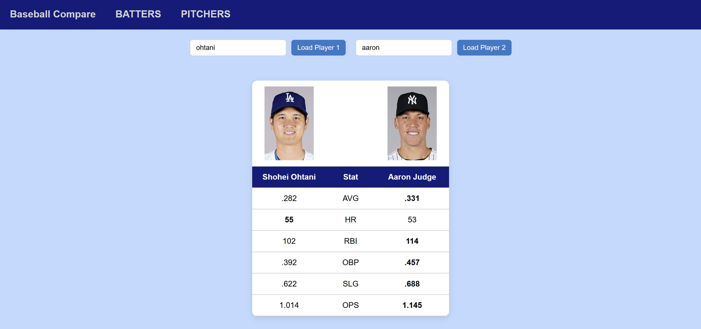

# Baseball Compare

👉 **[Visit the Website](https://jamesheo06.github.io/baseballcompare.github.io/)**  
Baseball Compare is a website that allows users to compare MLB players head-to-head using key statistics. Users can search for two players, load their profiles, and instantly view a stat comparison in a clean, easy-to-read layout.  

## Why?
As a passionate baseball fan and a bit of a stats nerd, I wanted a way to compare players in a clear and visually engaging format. When I couldn’t find a website that did exactly what I wanted, I decided to build one myself.

## Features
- Search and load MLB players
- Head-to-head comparison of player stats
- Supports batters and pitchers comparison
- Displays player images and key offensive metrics
- Simple and intuitive UI

## Future Additions
- Adding WAR, WRC+, and other important stats
- Adding option to allow users to choose different seasons to compare
- Adding other leagues like NPB, KBO, etc.
